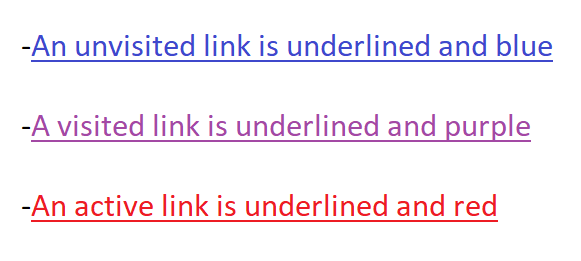
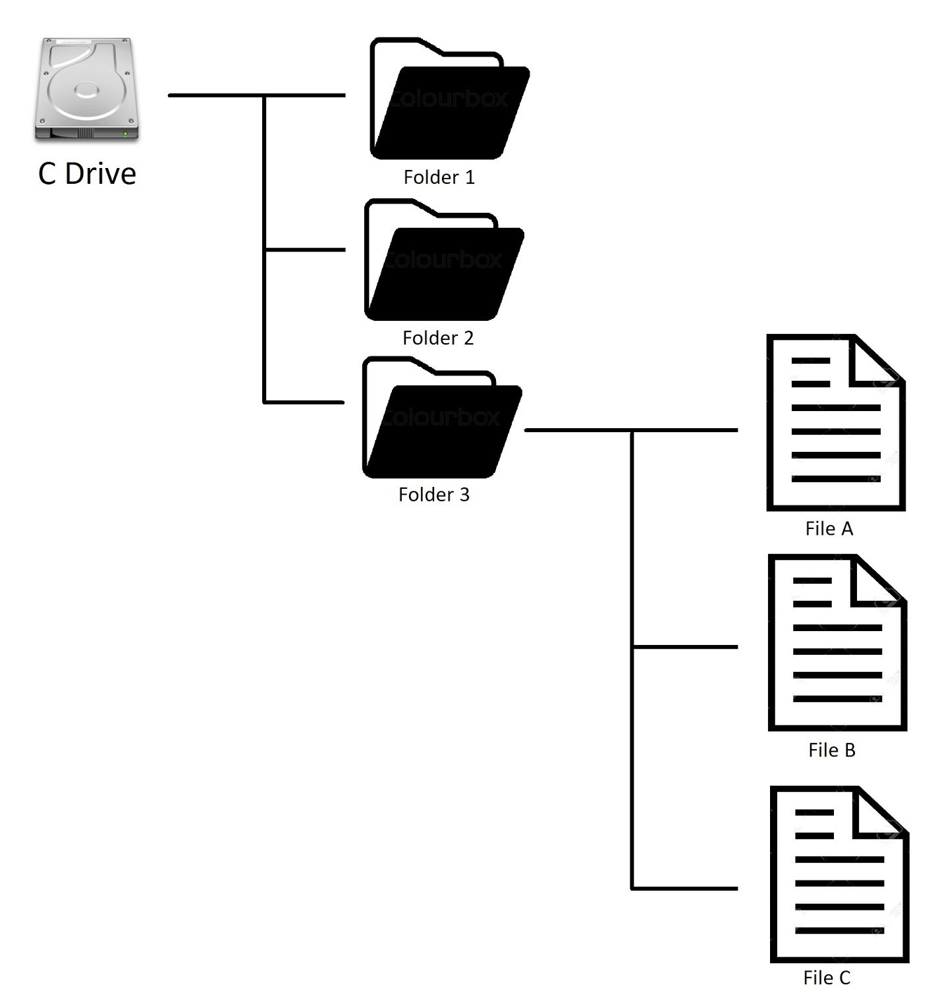

# HTML and CSS Cheat Sheet

Welcome to the HTML and CSS Cheat Sheet! This comprehensive guide is designed to be your go-to reference for all things HTML (Hypertext Markup Language) and CSS (Cascading Style Sheets). Whether you're a seasoned web developer looking for quick reminders or a newcomer eager to learn the fundamentals, this cheat sheet has got you covered.

## Contents
### Introduction
- [What is HTML?](#what-is-html)
- [What is CSS?](#what-is-css)
- [How to Use This Cheat Sheet?](#how-to-use-this-cheat-sheet)
- [How to Contribute](#how-to-contribute)
### Cheatsheets
- [HTML Cheatsheet](#html-cheatsheet)
- [HTML Meta Tags](#html-meta-tags)
- [HTML Browser Display Tags](#html-browser-displayed-tags)
- [HTML Attributes](#html-attributes)
- [CSS Cheatsheet](#css-cheatsheet)
### Details
- [HTML Tag Details](#html-tag-details)
- [HTML Attribute Details](#html-attribute-details)
- [CSS Details](#css-details)
### Words and Phrases
- [What's Metadata?](#metadata)
- [Head Elements](#head-elements)
- [Embedded Content](#embedded-content)
- [Body Elements](#body-elements)
- [Syntax](#syntax-6)
- [Attributes](#attributes)
- [File Paths](#file-paths)
- [Absolute and Relative Paths](#absolute-and-relative-paths)
- [Hypertext Reference](#hypertext-reference)


## What is HTML?

HTML is the backbone of the web. It is a markup language used to structure the content of web pages. HTML elements are represented by tags, which define the structure and layout of the content. Each tag serves a specific purpose, such as headings, paragraphs, images, links, and more. By combining these tags, you can create a well-organized and visually appealing web page.

## What is CSS?

CSS is the styling language that brings life and aesthetics to your HTML content. With CSS, you can define how HTML elements should be displayed on the page. It enables you to control colors, fonts, margins, padding, layouts, and many other visual aspects of your web page. By separating content (HTML) from presentation (CSS), you can make your web pages more maintainable and flexible.

## How to Use This Cheat Sheet

This cheat sheet is organized in a user-friendly manner, providing you with quick access to the most commonly used HTML and CSS elements. It includes code snippets and examples to help you understand how each element works in practice. Whether you're looking for a specific HTML tag or a CSS property, you can easily find it here.

The cheat sheet is divided into two main sections:

1. **HTML Cheat Sheet**: This section covers essential HTML tags and their attributes. You'll learn how to structure your content, add links, insert images, create lists, and more. 

It is broken into two sub sections [Tags](#html-meta-tags) and [Attributes](#html-attributes).

The opening tag defines the start of an HTML element (*The name for the combination of the tags, attributes and content between the tags*), and the closing tag defines the end of that element. The content between the opening and closing tags represents the actual content of the element.
```html
<!--Example of a HTML tag pair.-->
<p>This is a paragraph.</p>
```

HTML attributes are used to provide additional information or settings for HTML elements. They are specified within the opening tag of an element and are written as name-value pairs. Attributes provide extra details about how the element should behave, look, or interact with the user.
```html 
<!-- Example of a HTML attribute -->
<a href="https://www.example.com">Example Website</a>
```

2. **CSS Cheat Sheet**: In this section, you'll find a wide range of CSS properties along with their values and usage. From basic text styling to complex layouts, CSS offers a myriad of possibilities, and you'll find them all here.

Feel free to bookmark this cheat sheet for easy access whenever you need it. Whether you're building a personal website, an online portfolio, or a full-fledged web application, having this quick reference guide at your fingertips will save you time and effort.

## How to Contribute

This cheat sheet is a collaborative project, and we welcome contributions from the community. If you find any errors, have suggestions for improvement, or want to add new examples, please feel free to contribute. You can find the GitHub repository for this cheat sheet [here](https://github.com/mouldimus/Pitman_HTML_CSS.git). Your contributions will help make this resource even more valuable for developers worldwide.

Let's dive into the world of HTML and CSS, and make your web development journey a smooth and successful one! Happy coding! 🚀

## HTML Cheatsheet

### HTML Meta Tags
| Tag | Title | Description |
| --- | --- | --- |
| `<!-- -->` | [Comment](#html-comment-tag) | This tag is used to explain the purpose of your code, to yourself and other developers. *Do not* underestimate the power of code commenting. It is one the best tools to use to make your code easily understood and readable.
| `<!DOCTYPE>` | [Document Type](#document-type-doctype-tag) | Tells the browser what Document type and version to render the file in. |
| `<html>` | [HyperText Markup Language](#html-html-tag) | The `<html>` tag is a fundamental element in HTML documents. It represents the root element of an HTML document, and it contains all other HTML elements, such as headings, paragraphs, images, and more. |
| `<head>` | [Header](#html-head-tag) | This is the container for the information about the document |
| `<title>` | [Title](#html-title-tag) | This is the title of the document. The title displays inside the browser tab, Search engine results and Social media posts. |
| `<meta>` | [Metadata](#metadata) | Metadata is the data about data. 


### HTML Browser Displayed Tags
| Tag | Title | Description |
| --- | --- | --- |
| `<body>` | [Body](#html-body-tag) | This is where the main body of the content that is displayed lives in a html document (typically). |
| `<p>` | [Paragraph](#html-p-tag) | Used to define a paragraph of text in a HTML document. The `<p>` tag is a block-level element, which means it starts on a new line and creates a separate block of content. |
| `<h1>`,`<h2>`,`<h3>`,`<h4>`,`<h5>`,`<h6>` | [Headings](#html-heading-tags) | HTML provides six heading tags, `<h1>` to `<h6>`, that are used to define headings or subheadings in an HTML document. Headings help to structure the content, making it more organized and easily scannable for both readers and search engines. |
| `<footer>` | [Footer](#html-footer-tag) | A tag that implies that all the content inside of it is important infomation about the webpage. Just like a footer on a book. |
| `<main>` | [Main Content](#html-main-tag) | The HTML `<main>` element represents the most important content of the `<body>` of a document or portion of a document. |
| `<a>` | [Anchor Tags](#html-a-tags) | The anchor `<a>` element is the HTML code used to create a link to another page. It instructs the browser to display content from another document (typically a web page). |
| `<nav>` | [Navigation](#html-nav-tag) | The `<nav>` tag defines a set of navigation links. Navigation links are typically included on nav bars (a rectangular strip that includes links to the main pages on a website). 


### HTML Attributes

| Attribute | Title | Description |
| --- | --- | --- |
| `id` | [Identification](#id-attribute) | The id attribute specifies a unique name for an HTML element. | 


## CSS Cheatsheet


## HTML Tag Details
In this section I'll go into more detail of how each HTML tag works. I recommend using the linking structure available through the [HTML Tags Cheatsheet](#html-meta-tags).

--- 

### HTML `<body>` Tag
[HTML Tags Cheatsheet](#html-browser-displayed-tags)

The `<body>` tag is a crucial element in HTML documents. It defines the main content area of a web page where all the visible content, such as text, images, links, and other media, is displayed.

#### Syntax:

The `<body>` tag is an opening and closing tag represented by angle brackets:

```html
<body>
  <!-- HTML content goes here -->
</body>
```

#### Example Usage:

```html
<!DOCTYPE html>
<html lang="en">
<head>
  <meta charset="UTF-8">
  <title>My Web Page</title>
</head>
<body>
  <h1>Hello, World!</h1>
  <p>This is a sample HTML document.</p>
  
  <a href="https://www.example.com">Visit Example Website</a>
</body>
</html>
```

In this example, the `<body>` tag encloses the main content of the HTML document. Inside the `<body>` section, there are several elements, such as headings (`<h1>`), paragraphs (`<p>`), an image (``), and a hyperlink (`<a>`). These elements represent the visible content that will be displayed in the web browser when the page is loaded.

The content within the `<body>` tag is what users see and interact with when they visit the web page. It is essential to place all the content that should be displayed on the page within the `<body>` tag.

[HTML Tags Cheatsheet](#html-browser-displayed-tags)

### HTML `<nav>` Tag
[HTML Tags Cheatsheet](#html-browser-displayed-tags)

The `<nav>` tag defines a set of navigation links. Navigation links are typically included on nav bars (a rectangular strip that includes links to the main pages on a website). They look like this:

| [Home](#) | [About](#) | [FAQs](#) | [Contact](#) |
| --- | --- | --- | --- |

To create the above pictured navigation links, we would write our HTML code as follows:

```html
<nav>
  <a href="Home page filename or URL">Home</a>
  <a href="About page filename or URL">About</a>
  <a href="FAQs page filename or URL">FAQs</a>
  <a href="Contact page filename or URL">Contact</a>
</nav>
```

Typically the nav element contains implicit links – meaning links on most nav bars on websites don’t usually take you to another website altogether.

### HTML `<a>` Tags
[HTML Tags Cheatsheet](#html-browser-displayed-tags)

The anchor `<a>` element is the HTML code used to create a link to another page. It instructs the browser to display content from another document (typically a web page).

As a note, in older versions of HTML, the word anchor meant what element means now (opening and closing tags and the text in between). Anchor text is the clickable text that is displayed. For example, in this link the anchor text is “The Tech Academy”:

[The Tech Academy](https://www.learncodinganywhere.com/)

As a note, by default, most browsers display such links as follows:



The anchor element needs an attribute called an “href attribute.” “Href” is short for “hypertext reference.” This attribute contains the location of the resource or document that the author intends to link to.

Here is what it looks like:

```html
<a href="https://learncodinganywhere.com/">Check out The Tech Academy!</a>
```

This would display as:

[Check out The Tech Academy!](https://learncodinganywhere.com/)

and would take the user to the page at https://learncodinganywhere.com/.


### HTML `<main>` Tag
[HTML Tags Cheatsheet](#html-browser-displayed-tags)


The HTML `<main>` element represents the most important content of the `<body>` of a document or portion of a document. It consists of content that is directly related to or expands upon the central topic of a document.

For example:

```html
. . .
<body>
  <p>Cats are interesting creatures.</p>
  <main>
    <h1>Types of felines</h1>
    <p>Lions, tiger and house cats are common examples of felines.</p>
  </main>
  <h2>Lions</h2>
. . .
```


On a blog post, for example, the `<main>` element would be where the article is placed. There should only be one “main” element per HTML page.

### HTML `<footer>` Tag
[HTML Tags Cheatsheet](#html-browser-displayed-tags)

A footer is literally text that appears at the foot (bottom) of each page in a book or document.

The `<footer>` tag defines a footer for a document or section.

A footer element typically contains: authorship information, terms and conditions, copyright information, contact information and links to a company’s social media accounts. The bottom of most websites is the footer.

It is an important part of a webpage because it is usually used to give the user information needed to contact the primary owner or manager of the website.

### HTML Heading Tags
[HTML Tags Cheatsheet](#html-browser-displayed-tags)

Heading elements allow for placement of heads (titles) of sections. They’re broken into a series of graduated sizes: `<h1>` through `<h6>`.

So that you can see how they work, on the left we have the code and on the right is the output:

#### Code
```html 
<h1>Heading 1.</h1>
<h2>Heading 2.</h2>
<h3>Heading 3.</h3>
<h4>Heading 4.</h4>
<h5>Heading 5.</h5>
<h6>Heading 6.</h6>
```
#### Output
<h1>Heading 1.</h1>
<h2>Heading 2.</h2>
<h3>Heading 3.</h3>
<h4>Heading 4.</h4>
<h5>Heading 5.</h5>
<h6>Heading 6.</h6>

HTML provides six heading tags, `<h1>` to `<h6>`, that are used to define headings or subheadings in an HTML document. Headings help to structure the content, making it more organized and easily scannable for both readers and search engines.

Syntax:
Heading tags are opening and closing tags represented by angle brackets. The `<h1>` tag is used for the main heading, and the subsequent tags are used for subheadings, with `<h6>` being the smallest and least important subheading.

### HTML `<p>` Tag
[HTML Tags Cheatsheet](#html-browser-displayed-tags)

The `<p>` tag in HTML stands for "paragraph." It is used to define a paragraph of text in an HTML document. The `<p>` tag is a block-level element, which means it starts on a new line and creates a separate block of content.

#### Syntax:

The `<p>` tag is an opening and closing tag represented by angle brackets:

```html
<p>Paragraph content goes here.</p>
```

#### Example Usage:

```html
<!DOCTYPE html>
<html>
<head>
  <meta charset="UTF-8">
  <title>My Web Page</title>
</head>
<body>
  <h1>Welcome to My Website</h1>
  <p>This is a sample paragraph. It contains some text that forms a distinct block of content.</p>
  <p>Another paragraph can follow, continuing the flow of content.</p>
</body>
</html>
```

In this example, the `<p>` tags are used to create two separate paragraphs. Each paragraph starts on a new line, and there is spacing between them to visually separate the blocks of text.

#### Rendering:

When rendered in a web browser, the paragraphs will appear as follows:

---

#### Welcome to My Website

This is a sample paragraph. It contains some text that forms a distinct block of content.

Another paragraph can follow, continuing the flow of content.

---

Please note that the actual appearance of the text may vary based on the CSS styles applied to the HTML document.

[HTML Tags Cheatsheet](#html-browser-displayed-tags)


### HTML `<title>` Tag
[Back to HTML Tags Cheatsheet](#html-meta-tags)

The `<title>` tag is an essential element in HTML documents. It is used to define the title of the web page, which appears in the browser's title bar or tab. Additionally, search engines and social media platforms often use the title to display the page's name in search results and shared links.

#### Syntax:

The `<title>` tag is a standalone tag, and it is placed within the `<head>` section of the HTML document:

```html
<!DOCTYPE html>
<html>
<head>
  <title>Page Title Goes Here</title>
</head>
<body>
  <!-- Content of the web page -->
</body>
</html>
```

#### Example Usage:

```html
<!DOCTYPE html>
<html>
<head>
  <title>Welcome to My Website</title>
</head>
<body>
  <h1>Hello, World!</h1>
  <p>This is a sample web page.</p>
</body>
</html>
```

In this example, the `<title>` tag is used to set the title of the web page to "Welcome to My Website."

#### Importance:

The content within the `<title>` tag is crucial for several reasons:

1. **Browser Title:** It determines the text that appears in the browser's title bar or tab. This provides users with a quick reference to identify the page when they have multiple tabs open.

2. **Search Engine Results:** The title is a significant factor in search engine optimization (SEO). Search engines often display the page title as the main link in search results, and a well-crafted title can attract more clicks from users.

3. **Social Media Shares:** When a web page is shared on social media platforms like Facebook or Twitter, the title is usually used as the default title for the shared link. Having a descriptive and engaging title can encourage more users to click on shared links.

It's essential to choose a meaningful and descriptive title that accurately reflects the content of the web page. Additionally, keeping the title concise and relevant is beneficial for both users and search engines.

[Back to HTML Tags Cheatsheet](#html-meta-tags)


### HTML `<head>` Tag
[Back to HTML Tags Cheatsheet](#html-meta-tags)


The `<head>` tag is an essential element in HTML documents. It is a container for metadata and provides information about the HTML document, such as its title, character encoding, linked stylesheets, scripts, and more. The content within the `<head>` element is not directly visible on the web page; instead, it serves as a way to convey important information to web browsers and search engines.

#### Syntax:

The `<head>` tag is an opening and closing tag represented by angle brackets:

```html
<head>
  <!-- Metadata and other head-related content go here -->
</head>
```

#### Content:

Inside the `<head>` element, you can include various elements that provide metadata and define the behavior of the web page. Commonly used elements within the `<head>` tag include:

- `<title>`: Specifies the title of the HTML document, which is displayed in the browser's title bar or tab.
- `<meta>`: Provides various meta-information about the document, such as the character encoding, author, description, and viewport settings for mobile responsiveness.
- `<link>`: Links external resources like stylesheets (CSS) and web fonts to the HTML document.
- `<script>`: Embeds or references JavaScript code used for enhancing the page's functionality.

#### Example Usage:

```html
<!DOCTYPE html>
<html lang="en">
<head>
  <meta charset="UTF-8">
  <meta name="viewport" content="width=device-width, initial-scale=1.0">
  <title>My Web Page</title>
  <link rel="stylesheet" href="styles.css">
  <script src="script.js" defer></script>
</head>
<body>
  <!-- Content of the web page goes here -->
</body>
</html>
```

In this example, the `<head>` element contains metadata such as the character encoding (`<meta charset="UTF-8">`), the viewport settings (`<meta name="viewport" content="width=device-width, initial-scale=1.0">`), the document title (`<title>My Web Page</title>`), an external stylesheet (`<link rel="stylesheet" href="styles.css">`), and an external script (`<script src="script.js" defer></script>`).

[Back to HTML Tags Cheatsheet](#html-meta-tags)


### HTML `<html>` Tag
[Back to HTML Tags Cheatsheet](#html-meta-tags)

The `<html>` tag is a fundamental element in HTML documents. It represents the root element of an HTML document, and it contains all other HTML elements, such as headings, paragraphs, images, and more. The `<html>` tag provides the structural foundation for constructing web pages.

#### Syntax:

The `<html>` tag is an opening and closing tag represented by angle brackets:

```html
<html>
  <!-- HTML content goes here -->
</html>
```

#### Attributes:

An attribute is a word or phrase used inside an element’s opening tag that controls the element’s behavior.

For example, the image `` tag allows you to place images inside your webpage. The src (source) attribute is used with this `` tag; it gives the location of the image (where the image is being displayed from). You can see this in the following:

```html

```

The image tag tells the browser where to put the image on the page, while the src attribute gives the location to pull the image from.

The `<html>` tag can include certain attributes, but it typically uses the `lang` attribute to specify the language of the document for localization and accessibility purposes:

```html
<html lang="en">
  <!-- HTML content goes here -->
</html>
```

In the example above, the `lang="en"` attribute indicates that the content of the document is in English.

#### Example Usage:

```html
<!DOCTYPE html>
<html lang="en">
<head>
  <meta charset="UTF-8">
  <title>My Web Page</title>
</head>
<body>
  <h1>Hello, World!</h1>
  <p>This is a sample HTML document.</p>
  
</body>
</html>
```

In this example, the `<html>` tag encloses the entire HTML document, starting from the `<!DOCTYPE>` declaration and continuing with the `<head>` and `<body>` sections. Inside the `<head>` section, there are meta tags for character encoding and specifying the document title. In the `<body>` section, there are elements like headings, paragraphs, and an image.

[Back to HTML Tags Cheatsheet](#html-meta-tags)

### Document Type `<!DOCTYPE>` Tag
[Back to HTML Tags Cheatsheet](#html-meta-tags)

The `<!DOCTYPE>` declaration, often referred to as the "document type declaration" or "doctype declaration," is an important and required element in an HTML document. It informs web browsers about the version of HTML being used and helps them interpret and render the content correctly.

The `<!DOCTYPE>` declaration is not an HTML tag or element; it's an instruction provided at the very beginning of an HTML document, typically placed before the `<html>` opening tag. It looks like this:

```html
<!DOCTYPE html>
```

The `<!DOCTYPE html>` declaration is used for HTML5 documents. HTML5 is the latest version of HTML and is widely supported by modern web browsers. It is simpler and more standardized compared to previous versions of HTML.

The primary purpose of the `<!DOCTYPE>` declaration is to trigger "standards mode" in web browsers. In standards mode, browsers render the HTML document according to the HTML5 specification, which ensures consistency and compatibility across different browsers.

Before HTML5, different versions of HTML had different doctype declarations. For example:

HTML 4.01 Strict:
```html
<!DOCTYPE HTML PUBLIC "-//W3C//DTD HTML 4.01//EN" "http://www.w3.org/TR/html4/strict.dtd">
```

HTML 4.01 Transitional:
```html
<!DOCTYPE HTML PUBLIC "-//W3C//DTD HTML 4.01 Transitional//EN" "http://www.w3.org/TR/html4/loose.dtd">
```

XHTML 1.0 Strict:
```html
<!DOCTYPE html PUBLIC "-//W3C//DTD XHTML 1.0 Strict//EN" "http://www.w3.org/TR/xhtml1/DTD/xhtml1-strict.dtd">
```

Using the correct `<!DOCTYPE>` declaration is essential because it ensures that web browsers interpret the HTML document correctly and avoid any potential compatibility issues. With HTML5 being widely adopted and supported, the `<!DOCTYPE html>` declaration is the recommended and most commonly used doctype declaration for modern web pages.

[Back to HTML Tags Cheatsheet](#html-meta-tags)

### HTML Comment Tag
[Back to HTML Tags Cheatsheet](#html-meta-tags)

In HTML, the comment tag allows you to add comments within the HTML code that will not be displayed on the web page. Comments are useful for providing notes, explanations, or reminders for yourself or other developers working on the code. They can help make the code more understandable and maintainable.

#### Syntax:

HTML comments are denoted by the `<!--` and `-->` delimiters. Anything between these delimiters is considered a comment and will be ignored by web browsers during rendering.

```html
<!-- This is a comment -->
```

#### Example Usage:

```html
<!DOCTYPE html>
<html>
<head>
  <meta charset="UTF-8">
  <title>My Web Page</title>
</head>
<body>
  <!-- This is a comment explaining the purpose of the heading -->
  <h1>Hello, World!</h1>
  <!-- The following paragraph is for demonstration purposes -->
  <p>This is a sample HTML document.</p>
</body>
</html>
```

In the example above, there are two HTML comments. The first comment explains the purpose of the heading element, and the second comment provides additional information about the paragraph element.

Comments are not displayed on the rendered web page, but they can be viewed by inspecting the page's source code using browser developer tools.

[Back to HTML Tags Cheatsheet](#html-meta-tags)


## HTML Attribute Details
In this section I'll go into more detail of how each HTML attribute works. I recommend using the linking structure available through the [HTML Attributes Cheatsheet](#html-attributes).

### Id Attribute
[Jump Back](#html-attributes)

“Id” is short for “identification”. One of the most popular attributes is the id attribute.

The id attribute specifies a unique name for an HTML element.

For example, you can assign a specific `<p>` element the id (name) “paragraph” as follows:

```html
<p id="paragraph">This is some text.</p>
```

Now that you have that id, you can reference (bring up; refer to) it in your code later.

You will learn exactly how to do this and why it's useful in an upcoming step.

Ids are specific and you can only utilize one id per element. For example, you cannot assign the same `<h1>` element two different ids. Also, you cannot use the same id name for two different elements. For example, this would be incorrect:

```html 
<h2 id="heading"></h2>
<h3 id="heading"></h3>
```

Ids must be specific to one element and cannot contain any spaces.

## CSS Details

## Metadata
[Jump Back](#contents)

“Meta” comes from the word “beyond”.

Metadata is data that gives data about, or describes, other data. Simply put, metadata means: data about data.

In HTML, the `<meta>` tag is usually used to convey data to browsers and search engines that isn’t displayed to the user.

Meta elements can be used to describe pages, provide keywords to help categorize the type of information in the content of the page, note the author of the document, and more.

For example, the meta tag can be used to tell the search engine the name of an author as follows:

```html
<meta name="author" content="Lee Child">
```

The name here states type of metadata and the content provides a description. In this case, we are telling the search engine that the author is Lee Child.

## Head Elements
[Jump Back](#contents)

The `<head>` element is a container for metadata pertaining to the HTML document itself, and should be placed between the opening `<html>` tag and the opening `<body>` tag.

Head elements can contain:

1. Titles
2. Scripts (a computer program that is to be run by the browser)
3. File attachments (such as CSS files, JavaScript files or even custom fonts)
4. Character encoding
5. Meta data

The head element is typically placed near the top of an HTML file.

## Embedded Content
[Jump Back](#contents)

To embed means to fix something inside another thing. Content from another source that is included as part of a page is referred to as “embedded content”. This typically refers to content that exists on another website.

A common example is an embedded video. This would be like taking a video from YouTube and displaying it on your website.

## Body Elements
[Jump Back](#contents)

The content placed between `<body>` and `</body>` tags makes up most of the content on the page. It consists of nearly anything the developer can dream of, such as: embedded video, images, text, animation, tables of data, advertisements, even music. The sky’s the limit, but within the body tag is where you'll place it.

Here is an example:

```html
<!DOCTYPE html>
<html lang="en">
    <head>
        <title>Write title here.</title>
        <meta charset="utf-8">
    </head>
    <body>
      This is where all the content on the webpage goes.
    </body>
</html>
```

We use charset to set the exact character set we’re using and as mentioned earlier, UTF-8 is used for over 90% of websites. The [W3C actually recommends using UTF-8 for all websites.](https://www.w3.org/International/questions/qa-html-encoding-declarations)

## The Basic HTML Template
[Jump Back](#contents)

The code shown in the previous course step is actually the recommended basic template for all HTML web pages (meaning, regardless of what you add to the webpage, start with that code). Here it is again for reference:

```html
<!DOCTYPE html>
<html lang="en">
    <head>
        <title>Write title here.</title>
        <meta charset="utf-8">
    </head>
    <body>

    </body>
</html>
```

Glancing at the basic HTML example structure, you will notice that there are opening tags and, further down the page on the same indentation level, there are the corresponding closing tags.

This template contains the minimum set of usual data a browser will need to parse a web page and render the content to the screen.

*Rendering* technically means to take the HTML code and translate them into commands the Operating System can execute. Remember, at the end of the day, everything displayed on your screen is controlled by the hardware on your computer and your OS. When we say “render a webpage,” we mean: The web file is received by the browser and processed, the browser then “translates” and passes the data to the OS in a way it can understand and execute, your computer then processes the data and displays the resulting output. Simply put: rendering a web page is displaying a webpage.

A note on indenting the lines in your HTML documents: It is good practice, as you develop your HTML skills, to use indentation. Although an HTML document does not require any indentation, it will certainly make your code easier to read and more manageable to work with.

## Syntax
[Jump Back](#contents)

As a reminder, every spoken language has a general set of rules for how words and sentences should be structured. These rules are known as the syntax of that particular language.

In programming languages, syntax serves the same purpose.

Syntax is the rules you must follow when writing computer programs. Each language has its own syntax. Failing to use the syntax of a particular language correctly can mean that whatever program you are designing will not work at all.

For example: If a computer language required you write “cmd:” (meaning “command”) at the beginning of each instruction, that would be part of the syntax of that language. And if you didn’t write “cmd:” at the beginning of an instruction, the computer would not be able to process and execute the instruction because you violated syntax.

If you wrote the `<title>` tag like this: `<ttle>`, there would be a syntax error and your web page wouldn’t display properly (in this case, the title wouldn’t display).

## File Paths
[Jump Back](#contents)

As a reminder, a hierarchy refers to arranging things according to rank or status. It refers to arranging items according to their relative importance or characteristics.

A common example of hierarchy would be how most companies are arranged: the bosses and their functions are compartmented. For example: there’s a Chief Executive Officer (CEO; boss) over the company, and a Chief Financial Officer (CFO) that oversees the accounting department.

Storage hierarchy refers to a system where various data storage devices are given a hierarchical importance ranking as far as how they are used by the CPU. The primary factor influencing a given device's ranking is its response time – how long the device takes to return a requested piece of stored data when the CPU requests the data. Faster response times are ranked higher.

A “hierarchical file system” refers to how files are organized and displayed.

It is how drives, folders and files are organized and displayed on a computer. In a hierarchical file system, the drives, folders, and files are shown in groups, which allows the user to see only the files they want to.

Here is a hierarchical file system diagrammed out:



Inside hierarchical file systems are directories. A directory is a location for storing files on your computer. Directories are another word for “folders.” The terms folder and directory are interchangeable.

The route to a file is called a “file path.” The “file path” is the address of a file and specifies the exact location of a file. It provides a “path” to the file.

It says, “You can find the file named ‘Winter,’ inside the folder named ‘Poems,’ inside the C drive.”

The various components of a path are separated by a character. Usually this character is a slash, backslash or colon (“/,” “\” or “:” respectively).

The “/” (slash) symbol separates the different parts of a collection of electronic documents in computers and it has been used for a long time. It was created as an aid to organizing and finding the various files you might store on a computer.

Slash is used to show that one item is below another. The item on the left is above the one on the right. An example of this could be:

```
C:/Recipes/BakedChickenRecipe.txt
```
In this example, the drive is the C Drive (name of the hard drive), the folder is called “Recipes,” which contains a text document called “BakedChickenRecipe.”

Code should be organized by file and folder. Here is an example diagram of a web site's folder structure:


A file path describes the location of a file in a web site's folder structure. File paths are used when linking an HTML file to external files like:

1. Style sheets (files containing the CSS code that styles the website)
2. JavaScript files
3. Web pages
4. Images

[Jump Back](#contents)

## Absolute and Relative Paths
A standard path usually consists of three components:

1. A ***volume*** (a single accessible storage area with a single file system – typically residing in a single partition [section] of a hard disk) or drive letter followed by a colon ( : ) in Windows. For example, “C:” (drive) or “D:” (drive).
2. A **directory name**. A backslash (\) separates subdirectories within the nested directory hierarchy. Forward slashes are frequently accepted as well. For example, “\Documents” or “\Program Files”.
3. A filename. The backslash separates the file path and the filename. For example, “\letter.docx” or "\picture.jpeg".

*If all three of these components are present, the path is absolute.*

*If no volume or drive letter is specified and the directory name begins with a backslash, the path is relative.*

An absolute path may look something like:

```bash
C:\GitHubRepos\HTML_CSS\PathProject\FileName.html
```
On the other hand, a relative path may have differing beginnings depending on your folder structure. Commonly seen examples include:

- **Picture.jpg** – where the picture file is in the same folder as the requesting file.
- **images/picture.jpg** and **./images/picture.jpg** – where the picture file is located in a folder called images on the same folder level as the requesting file.
- **../images/picture.jpg** – where the picture file is located in a folder called images which is in the folder one level up from the current folder of the requesting file.

It is recommended that you use relative paths when linking to images, CSS files, JavaScript files, etc. The reason for this is that if your code is run on a different machine, the absolute path may change – but the relative path always stays the same.

## Hypertext Reference
There are two kinds of `href` attributes:

1. Implicit
2. Explicit

In normal English, **implicit**
: *“implied, though not plainly stated”.*

**Explicit**
: *“stated clearly and in detail.”*

Implicit `href` attributes are used to create a link to another webpage that is located in the same folder as the page the `<a>` tag is in. If we use the folder that is your local repository as an example, an implicit link would link to a file within that folder.

An anchor element with an implicit href attribute would be written as follows:

```html
<a href="yourfilename.html">
  Whatever link title you choose
</a>
```

Whereas an explicit href attribute links to a file not contained within the folder(s) associated with your website. Typically explicit href attribute links are to external websites (other websites). The `href` attribute from the previous step 

```html
<a href="https://learncodinganywhere.com/">
  Check out The Tech Academy!
</a>
```

 is an example of an explicit link.

Both of these will be clarified further in the next two assignments.

